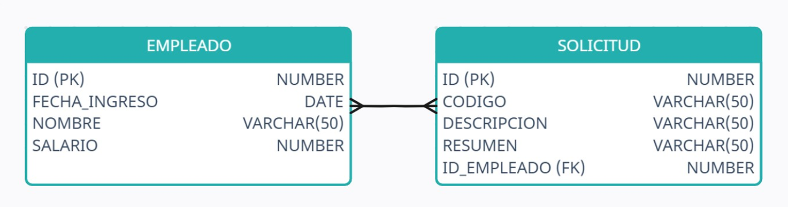
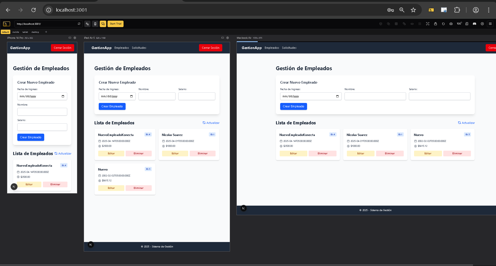
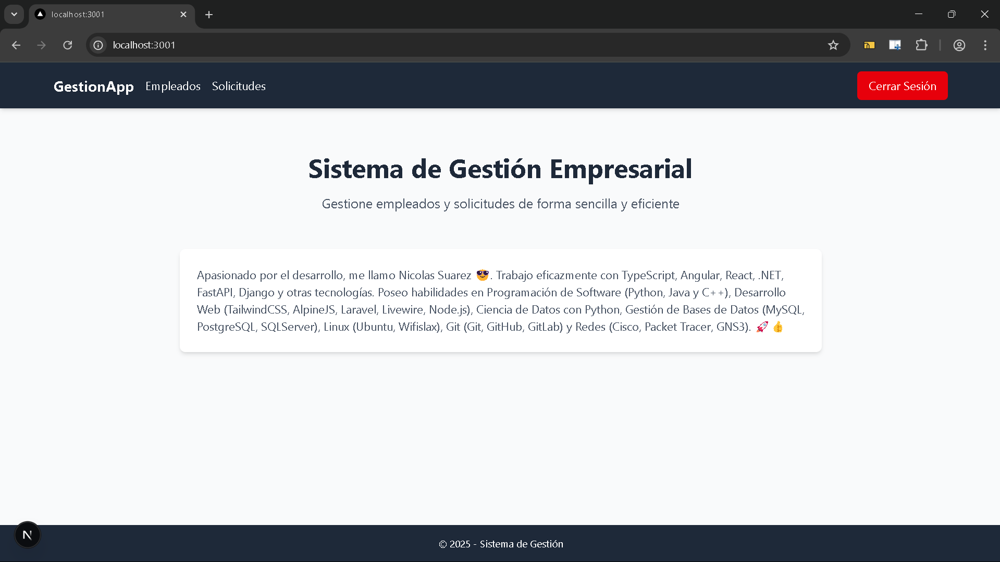
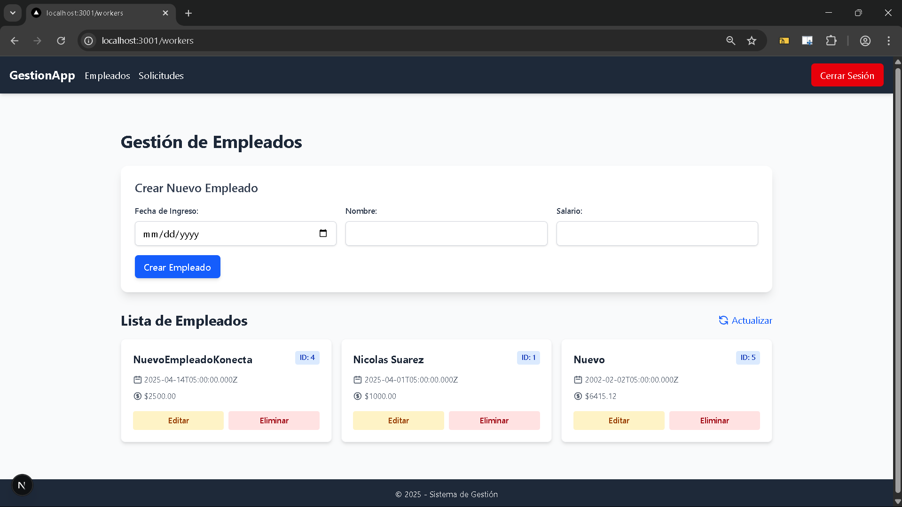
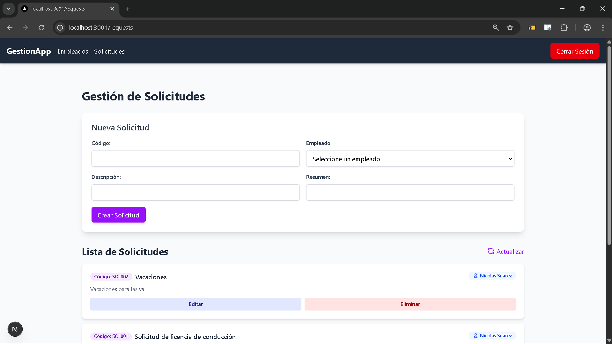
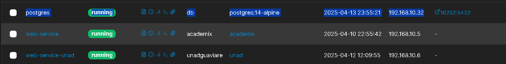
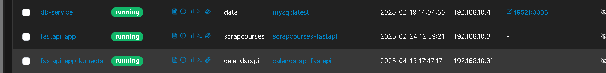
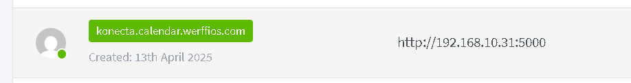
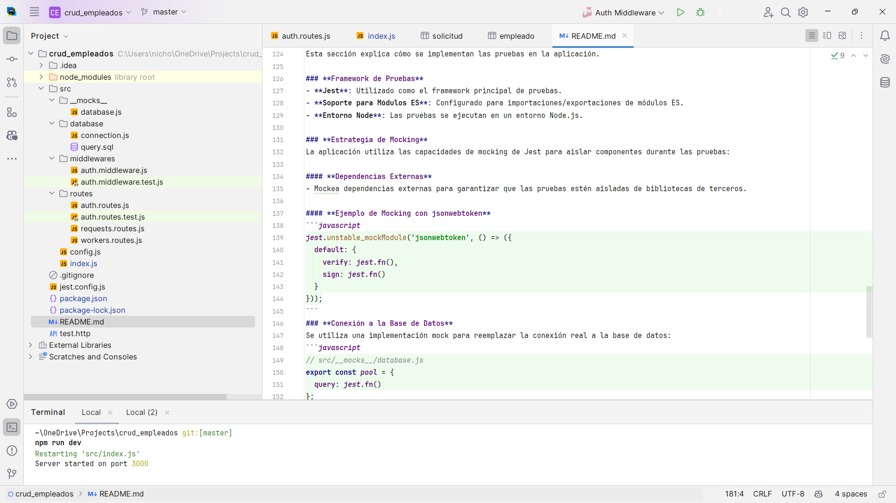
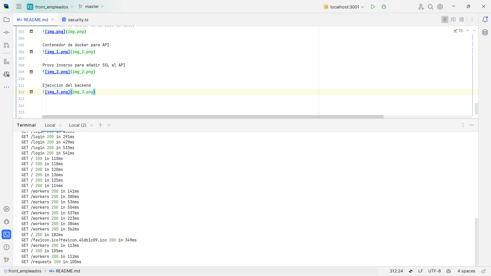

# SOLUCIÓN DE PRUEBA KONECTA

### Nombre: Nicolás Alonso Suárez Rodríguez
### Fecha: 2025-04-14

## 1.  CASO DE USO PROGRAMACIÓN JAVA (40%)

### 1.1.  Descripción del problema

El área de nómina de Konecta necesita un aplicativo que le indique cuando debe pagar la nómina
a sus empleados. Normalmente, la nómina se paga los días 15 y 30 de cada mes. En el caso en
que dicho día no sea hábil, la nómina se debe pagar siempre el día hábil directamente anterior.
Desarrolle un código en Java que reciba una fecha en el formato yyyy-mm-dd y aplique la lógica
necesaria para devolver la próxima fecha de pago de la quincena. Tenga en cuenta los festivos
colombianos.

Nota: Puede hacer uso de los elementos externos que crea necesarios (base de datos, archivos,
entre otros.)

#### Ejemplos:

- Si el usuario ingresa 2024-02-05, la fecha a devolver será 2024-02-15.
- Si el usuario ingresa 2024-03-30 que es sábado, debido a la semana santa, la fecha a devolver será
2024-03-27.
- Si el usuario ingresa 2024-06-30 que es domingo, la fecha a devolver será 2024-06-28.
- Si el usuario ingresa 2024-07-15, la fecha a devolver será 2024-07-15.

Formato de entrega: Proyecto en repositorio remoto público (Ej: GitHub)

### 1.2.  Solución

Para resolver el problema, se ha creado un api usando FastAPI, un framework de Python que permite
crear aplicaciones web de manera rápida y sencilla. La API tiene un endpoint que recibe una fecha 
en formato `yyyy-mm-dd` y devuelve si la fecha es festiva o no.

La API utiliza la librería `holidays` para verificar si una fecha es festiva en Colombia.

### 1.3.  Código

El código se encuentra en el siguiente repositorio: https://github.com/Werffios/calendarAPI.git

# USO DEL API

El api se encuentra desplegado en el siguiente link: https://konecta.calendar.werffios.com/ dominio 
propio, se realizó de esta manera para facilitar el uso del api y no tener que instalar nada en su
máquina.

- Ejemplo de uso:

**Petición GET:**

```bash
  https://konecta.calendar.werffios.com/festivo/2025-04-18
```
**Respuesta:**
   ```json
  {
  "fecha": "2025-04-18",
  "festivo": true,
  "nombre_festivo": "Viernes Santo"
  }
```

Documentación de la API: https://konecta.calendar.werffios.com/docs

### 1.4.  Repositorio de NominaKonecta

Continuando con la solución del problema, se ha creado un repositorio para la nómina de Konecta
el cual se distribuye en tres partes:


```
NominaApp/ 
└─ src/ 
    ├─ Main.java 
    ├─ PayrollCalculator.java 
    └─ HolidayChecker.java
```

- **Main.java:** Contiene el método `main` donde se solicita la fecha de entrada y se muestra la próxima fecha de pago.
- **PayrollCalculator.java:** Implementa la lógica para determinar la fecha de pago, ajustándola en caso de que la fecha programada no sea hábil.
- **HolidayChecker.java:** Se encarga de consultar el API de festivos para verificar si una fecha es festiva.


## Descripción de los Archivos

### Main.java

Este archivo:
- Solicita al usuario una fecha en formato `yyyy-MM-dd`.
- Transforma el string recibido a un objeto `LocalDate`.
- Llama al método `getProximoPago()` de la clase `PayrollCalculator` para obtener la fecha de pago ajustada.
- Imprime la fecha resultante.

### PayrollCalculator.java

Contiene la lógica principal:
- Determina la fecha de pago programada (15 o 30 del mes) basándose en la fecha ingresada.
- Utiliza un bucle para retroceder día a día si la fecha calculada es un día no hábil (por fin de semana o festivo).
- Llama al método `esNoHabil()` para hacer la verificación correspondiente.

### HolidayChecker.java

Este archivo:
- Utiliza la API de Konecta (`https://konecta.calendar.werffios.com/festivo/{fecha}`) para verificar si una fecha es festiva.
- Realiza una petición GET mediante la API HTTP de Java (disponible en JDK 24) y analiza la respuesta de manera simple buscando la clave `"festivo":true`.
- Si hay algún error (por ejemplo, problemas de conexión), asume que la fecha no es festiva.

### Conclusión

La solución presentada permite calcular la próxima fecha de pago de nómina teniendo en cuenta los días hábiles y festivos. La implementación es sencilla y se puede extender fácilmente para incluir más funcionalidades si es necesario.

---

##  2. CONOCIMIENTOS EN NODE JS (50%)
### 2.1.  Descripción del problema

* Backend: Crear una API REST simple utilizando Node.js.
* Frontend: Desarrollar una interfaz de usuario utilizando React con componentes funcionales y
  hooks.
* Base de Datos: Elección libre, preferiblemente Oracle o PostgreSQL.
* Autenticación: Implementar un mecanismo básico de autenticación.
* Pruebas: (Opcional) Incluir algunas pruebas unitarias para el backend

#### **Funcionalidades Específicas**
* Backend (API REST)
* Desarrollar endpoints para consultar e insertar información en la tabla 'empleado'.
* Desarrollar endpoints para consultar, insertar y eliminar información en la tabla solicitud.
  Relaciones y Consultas:
* Asegurarse de que al consultar solicitudes, se muestre el nombre del empleado y no su ID.
  Frontend (Interfaz de Usuario)
* Crear vistas sencillas para las operaciones CRUD mencionadas, enfocándose en funcionalidad
  sobre diseño.
* (Seguridad) Implementar medidas básicas para prevenir inyecciones SQL y XSS, como validar
  y sanear entradas.
* (Opcional) Evitar librerías externas para el manejo de estado, usando Context API o useState
  para ejemplos simples.

### 2.2.  Solución
La solución presentada es una aplicación CRUD de empleados y solicitudes, desarrollada utilizando postgres como motor de
base de datos, Node.js para el backend y React para el frontend. 

A continuación, se describen los componentes principales de la solución:


## **Tecnologías**
- **Node.js**
- **Express.js**
- **PostgreSQL**
- **JWT** para autenticación.
- **bcrypt** para el hash de contraseñas.
- **Jest** para pruebas.
- **React** para el frontend.
- **Axios** para las peticiones HTTP.
- **Tailwind CSS** para el diseño.
- **Postman** para pruebas de la API.
- **Docker** para la contenedorización de la base de datos.
- **Framer Motion** para animaciones en el frontend.

## **Base de Datos**

La base de datos utilizada es PostgreSQL, y se ha creado un contenedor Docker para facilitar su uso, el docker-compose.yml
se ve asi:

```yml
services:
  postgres:
    image: postgres:14-alpine
    container_name: postgres
    environment:
      POSTGRES_USER: root
      POSTGRES_PASSWORD: asjnlksacdeacse
      POSTGRES_DB: konecta
    volumes:
      - ./data:/var/lib/postgresql/data
    ports:
      - "16252:5432"
    networks:
      net:
        ipv4_address: 192.168.10.32
    restart: always

networks:
  net:
    external: true
```
### **Estructura de la Base de Datos**
La aplicación utiliza tres tablas principales, el query directo de creación lo puedes encontrar en el link
[query.sql](https://github.com/Werffios/crud_empleados/blob/master/src/database/query.sql)

## Documentación completa del backend
La documentación completa de la API se encuentra en el siguiente link: [Documentación](https://github.com/Werffios/crud_empleados)

## **Frontend**

El frontend está desarrollado en React y utiliza Tailwind CSS para el diseño. La aplicación permite realizar operaciones
CRUD sobre los empleados y solicitudes, y se comunica con el backend a través de Axios.

Se desarrolló una interfaz sencilla para las operaciones CRUD, enfocándose en la funcionalidad y la usabilidad.
El diseño es responsivo y se adapta a diferentes tamaños de pantalla.









## Sistema de Autenticación
La aplicación implementa un sistema de autenticación basado en JWT \(JSON Web Token\) con los siguientes componentes clave:

- Contexto de Autenticación  
El sistema utiliza la API de Contexto de React para gestionar el estado de autenticación en toda la aplicación:

- AuthContext: Proporciona el estado de autenticación y funciones en toda la aplicación  
- AuthProvider: Envuelve la aplicación para hacer disponibles los servicios de autenticación  
- Gestión de Tokens: Almacena el JWT tanto en el estado de React como en localStorage para persistencia  

#### Flujo de Autenticación  
2.2.1 Proceso de Inicio de Sesión:

* Credenciales de usuario son verificadas a través de la API  
* Tras una autenticación exitosa, el servidor devuelve un JWT  
* El token se almacena en localStorage y en el estado de AuthContext  
* El usuario es redirigido a la página de inicio  

2.2.2 Persistencia de Sesión:

* Al cargar la aplicación, AuthProvider verifica localStorage en busca de tokens existentes  
* Si se encuentra alguno, la sesión del usuario se restaura automáticamente  

2.2.3 Proceso de Cierre de Sesión:

* Elimina el token tanto de localStorage como del estado de contexto  
* Redirige al usuario a la página de inicio de sesión  

2.2.4 Solicitudes API Seguras  
* **Todas las solicitudes API autenticadas se gestionan a través de una instancia personalizada de axios:**

* Interceptors de Axios: Adjuntan automáticamente el token de autenticación a todas las peticiones salientes  
* Encabezado de Autorización: Agrega el token en el formato Bearer \{token\}  
* Manejo de Errores: Gestiona de forma adecuada los errores de autenticación provenientes de la API  

# 2.3 Seguridad en la Entrada de Datos: Protección contra SQL Injection y XSS
La aplicación implementa un sistema robusto de validación y sanitización para mitigar riesgos de seguridad como inyección SQL y ataques XSS (Cross-Site Scripting). A continuación se explica cómo funciona:

### 2.3.1 Implementación en los Formularios

En Formulario de Login:
```javascript
const sanitizedData = {
    username: sanitize.string(data.username),
    password: data.password // No se sanitiza la contraseña
};
```
```javascript
const sanitizedData = {
    nombre: sanitize.string(data.nombre),
    fecha_ingreso: sanitize.string(data.fecha_ingreso),
    salario: sanitize.number(data.salario).toString()
};
```

---

# 3.  CONOCIMIENTOS DE GIT. (10%)

##  Documente los comandos que utilizó para subir los proyectos al repositorio remoto.

```bash
    git init                                               # Inicializa el repositorio local
    git add .                                              # Añade todos los archivos al staging area
    git commit -m "Initial commit"                         # Realiza el primer commit
    git branch -M master                                   # Renombra la rama principal a 'master'
    git remote add origin https://github.com/Werffios/front_empleados.git  # Vincula al repositorio remoto
    git push -u origin main                                # Sube los cambios al repositorio remoto
```

### 3.1 Proceso detallado
Creación del repositorio remoto:

### 3.2 Primero creé el repositorio en GitHub a través de la interfaz web
Configuré el repositorio como público para facilitar el acceso a los evaluadores
Inicialización local y vinculación:

### 3.3 Utilicé git init para inicializar el repositorio local
Con git remote add origin [URL] establecí la conexión entre mi repositorio local y el remoto

### 3.4 Autenticación:
Autorice el acceso a mi cuenta de GitHub desde el IDE por medio de un token de acceso personal

> [!NOTE]
> Para este proyecto no fue necesario implementar flujos más complejos como GitHub Actions o pull requests, aunque en proyectos más grandes con equipos he trabajado con:
> 
> Pull requests con revisión de código 
> CI/CD mediante GitHub Actions 
> Resolución de conflictos en merges 

# 4. Otras imágenes

Contenedor de docker de la base de datos


Contenedor de docker para API


Proxy inverso para añadir SSL al API


Ejecución del backend


Ejecución del frontend


